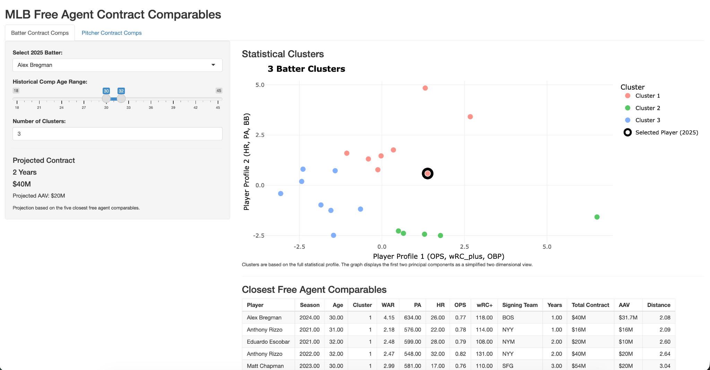

# MLB Free Agent Contract Projection

An interactive R Shiny application that identifies statistically comparable MLB players and uses historical free agent contracts to estimate contract value.

## Project Overview

This project was built to explore how player similarity can be used in MLB free agent contract projections. Users can select a current batter or pitcher and compare that player to historical free agents based on statistical performance, age, and position.

The application identifies the closest statistical comparisons and uses their previous contracts to generate an estimated contract length, total value, and average annual value.
## Features

- Separate analysis for batters and pitchers
- Custom historical age ranges
- Adjustable number of player clusters
- K means clustering using standardized player statistics
- Principal component analysis for two dimensional visualization
- Interactive Plotly cluster graphs
- Statistical similarity rankings for historical free agents
- Contract information for the 10 closest comparable players
- Contract projections based on the five closest free agent comparisons

## Methodology

Player statistics are standardized before applying k means clustering. Principal component analysis is used to display the multidimensional player profiles in two dimensions.

Player similarity is calculated using Euclidean distance across the full standardized statistical profile rather than the two dimensional PCA visualization.

For batters, comparisons include statistics such as WAR, PA, HR, BB, SO, AVG, OBP, SLG, OPS, and wRC+.

For pitchers, comparisons include WAR, IP, ERA, K/9, BB/9, K/BB, H/9, HR/9, WHIP, and FIP.

The five closest historical free agent comparisons are then used to estimate contract length, total contract value, and average annual value.

## Tools Used

- R
- Shiny
- tidyverse
- ggplot2
- Plotly
- K means clustering
- Principal component analysis
- Data visualization

## Data

The application uses MLB player performance and free agent contract data from 2020 through 2025.

## Files

- `app.R` — Shiny application and analysis
- `Batting_Contracts.csv` — Batter statistics and contract data
- `Pitching_Contracts.csv` — Pitcher statistics and contract data
- `Free_Agent_Signings_2021_2025.csv` — Historical free agent signing data
